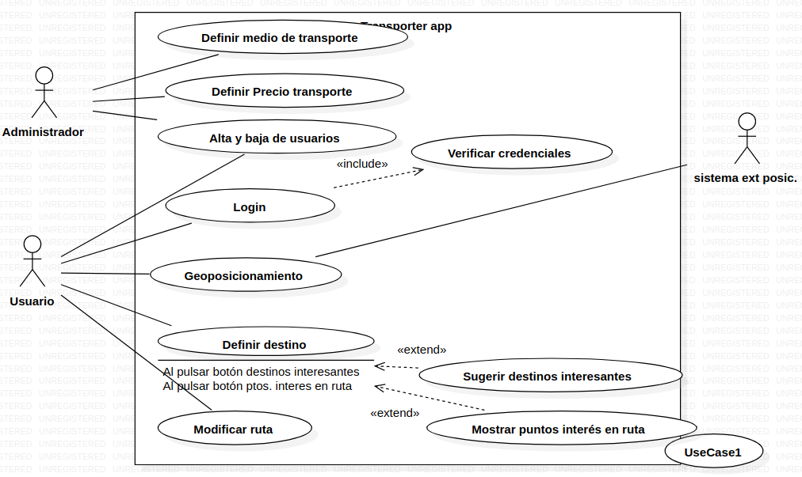

# Diagrama de comportamiento

En este ejercicio procederemos a analizar el diagrama de comportamiento de la siguiente imagen: 

## Actores
| Actor | Administrador |
|---|---|
| Descripción | El administrador es la persona encargada de gestionar y controlar el sistema relacionado con los medios de transporte. Tiene privilegios para definir y modificar los parámetros y configuraciones del sistema. |
| Características | Capacidad para gestionar usuarios, acceso a funciones administrativas, conocimiento técnico del sistema de transporte. |
| Relaciones | Se relaciona con otros actores como Usuarios (puede gestionar cuentas), Proveedores de servicios de transporte (puede agregar o modificar opciones de transporte), y Sistema (interactúa para realizar configuraciones). |
| Referencias | Realiza acciones relacionadas con la administración del sistema, como "Gestionar usuarios", "Configurar opciones de transporte", y "Modificar parámetros del sistema". |
| Notas | El administrador puede ser una persona designada con conocimientos técnicos o un rol dentro de la organización encargada de la gestión del sistema de transporte. |
| Autor | Rashi Chugani Narwanni |
| Fecha | 16/01/2024 |

## Casos de uso
| Caso de Uso CU | Definir Medio de Transporte |
|---|---|
| Fuentes | Documento de requisitos del sistema. |
| Actor | Administrador |
| Descripción | Permite al administrador definir un nuevo medio de transporte en el sistema, especificando sus características y parámetros. |
| Flujo básico | 1. El administrador inicia sesión en el sistema. 2. Navega a la sección de "Definir Medio de Transporte". 3. Ingresa la información del nuevo medio de transporte (nombre, tipo, capacidad, etc.). 4. Confirma la adición del nuevo medio de transporte. |
| Pre-condiciones | El administrador ha iniciado sesión en el sistema. |
| Post-condiciones | El nuevo medio de transporte se registra en el sistema y está disponible para su uso. |
| Requerimientos | Acceso a la función de administración de medios de transporte. |
| Notas | Este caso de uso es fundamental para mantener actualizado el catálogo de medios de transporte disponibles en el sistema. |
| Autor | Rashi Chugani Narwanni |
| Fecha | 16/01/2024 |