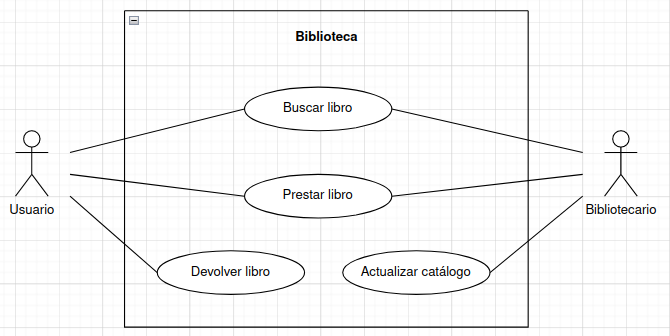

# Sistema de biblioteca
En este ejercicio procederemos a analizar el diagrama de comportamiento de la siguiente imagen: 

## Actores
|  Actor | Usuario |
|---|---|
| Descripción  | Persona que utiliza el sistema de biblioteca para buscar, prestar y devolver libros.  |
| Características  | - Capacidad para buscar libros por título, autor, etc. - Capacidad para realizar préstamos y devoluciones. - Puede acceder a su historial de préstamos. |
| Relaciones | Interactúa con el caso de uso "Buscar Libro", "Prestar Libro", "Devolver Libro". |
| Referencias | Buscar Libro, Prestar Libro, Devolver Libro |
| Notas | - Los usuarios pueden tener diferentes niveles de acceso según su tipo (estudiante, profesor, etc.). |
| Autor | Rashi Chugani Narwanni |
| Fecha | 18/01/2024 |

|  Actor | Bibliotecario |
|---|---|
| Descripción  | Personal encargado de la gestión y administración del sistema de biblioteca.  |
| Características  | - Capacidad para gestionar el inventario de libros. - Puede registrar nuevos libros en el sistema. - Gestiona los préstamos y devoluciones. |
| Relaciones | Interactúa con el caso de uso "Gestionar Inventario", "Registrar Libro", "Gestionar Préstamos". |
| Referencias | Gestionar Inventario, Registrar Libro, Gestionar Préstamos |
| Notas | - Puede tener acceso a informes y estadísticas sobre el uso de la biblioteca. |
| Autor | Rashi Chugani Narwanni |
| Fecha | 18/01/2024 |

## Casos de uso
|  Caso de Uso	CU | Buscar Libro  |
|---|---|
| Fuentes  | Catálogo de la biblioteca  |
| Actor  | Usuario  |
| Descripción | Permite al usuario buscar libros en el catálogo de la biblioteca.  |
| Flujo básico | 1. El usuario inicia sesión en el sistema. 2. Navega al catálogo de libros. 3. Ingresa criterios de búsqueda (título, autor, etc.). 4. Examina los resultados de búsqueda. |
| Pre-condiciones | El usuario ha iniciado sesión en el sistema. |
| Post-condiciones  | El usuario visualiza una lista de libros que coinciden con los criterios de búsqueda.  |
| Requerimientos | Conexión a Internet para acceder al catálogo en línea.  |
| Notas | - Se pueden proporcionar filtros avanzados para mejorar la precisión de la búsqueda. |
| Autor | Rashi Chugani Narwanni |
| Fecha | 18/01/2024 |

|  Caso de Uso	CU | Prestar libros  |
|---|---|
| Fuentes  | Sistema de préstamos  |
| Actor  | Bibliotecario  |
| Descripción | Permite al bibliotecario gestionar los préstamos de libros realizados por los usuarios.  |
| Flujo básico | 1. El bibliotecario inicia sesión en el sistema. 2. Accede a la sección de gestión de préstamos. 3. Visualiza los préstamos activos y su estado. 4. Registra la devolución de libros. |
| Pre-condiciones | El bibliotecario ha iniciado sesión y tiene los permisos adecuados. |
| Post-condiciones  | El sistema registra la devolución de libros y actualiza el estado de los préstamos.  |
| Requerimientos | Conexión a la base de datos del sistema de biblioteca.  |
| Notas | - Se pueden generar multas por devoluciones tardías. |
| Autor | Rashi Chugani Narwanni |
| Fecha | 18/01/2024 |

|  Caso de Uso	CU | Devolver Libro  |
|---|---|
| Fuentes  | Sistema de préstamos, Inventario de la biblioteca  |
| Actor  | Usuario  |
| Descripción | Permite al usuario devolver un libro prestado a la biblioteca.  |
| Flujo básico | 1. El usuario inicia sesión en el sistema. 2. Accede a la sección de "Mis Préstamos" o una función similar. 3. Selecciona el libro que desea devolver. 4. Confirma la devolución. 5. El sistema verifica la devolución y actualiza el estado del libro. |
| Pre-condiciones | El usuario ha iniciado sesión y tiene libros prestados. |
| Post-condiciones  | El libro se registra como devuelto, y el estado del préstamo se actualiza en el sistema.  |
| Requerimientos | El libro debe estar en buen estado para la devolución.  |
| Notas | - Se pueden generar recordatorios automáticos para la devolución próxima. - Puede haber un período de gracia para devoluciones tardías antes de aplicar multas. |
| Autor | Rashi Chugani Narwanni |
| Fecha | 18/01/2024 |

|  Caso de Uso	CU | Actualizar Catálogo  |
|---|---|
| Fuentes  | Catálogo de la biblioteca, Sistema de inventario  |
| Actor  | Bibliotecario  |
| Descripción | Permite al bibliotecario agregar, eliminar o actualizar información en el catálogo de la biblioteca.  |
| Flujo básico | 1. El bibliotecario inicia sesión en el sistema. 2. Accede a la sección de gestión de catálogo. 3. Selecciona la opción de actualizar catálogo. 4. Agrega nuevos libros, actualiza detalles o elimina registros según sea necesario. |
| Pre-condiciones | El bibliotecario ha iniciado sesión y tiene los permisos adecuados. |
| Post-condiciones  | El catálogo se actualiza según las modificaciones realizadas por el bibliotecario.  |
| Requerimientos | Conexión a la base de datos del sistema de biblioteca.  |
| Notas | - Se puede incluir la capacidad de cargar información en formato de archivo para realizar actualizaciones masivas. - El sistema puede generar registros de cambios para mantener un historial del catálogo. |
| Autor | Rashi Chugani Narwanni |
| Fecha | 18/01/2024 |
