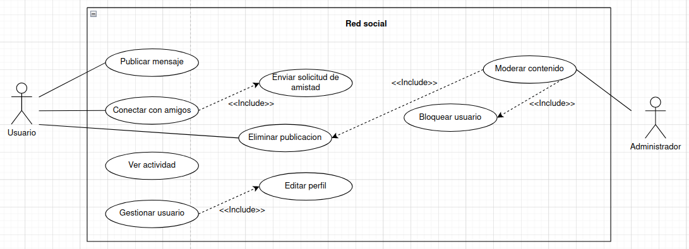

# Red social
En este ejercicio procederemos a analizar el diagrama de comportamiento de la siguiente imagen: 

## Actores
| Actor  | Usuario  |
|---|---|
| Descripción  | Usuario registrado en la aplicación de red social. Puede interactuar con la plataforma para publicar mensajes, conectar con amigos y realizar otras acciones sociales.  |
| Características  | - Puede publicar mensajes. - Puede conectar con amigos. - Puede ver su actividad y la de sus amigos.  |
| Relaciones  | - Realiza acciones similares a otros usuarios. - Interactúa con casos de uso como "Publicar Mensaje", "Conectar con Amigos" y "Ver Actividad".  |
| Referencias  | - Participa en casos de uso relacionados con interacción social.  |
| Notas  | - Puede tener atributos adicionales, como "Número de Amigos" o "Número de Seguidores".  |
| Autor | Rashi Chugani Narwanni |
| Fecha | 20/01/2024 |

| Actor  | Administrador  |
|---|---|
| Descripción  | Usuario con privilegios especiales encargado de gestionar y moderar la plataforma de la red social. |
| Características  | - Puede gestionar usuarios. - Puede eliminar publicaciones. - Puede moderar contenido. |
| Relaciones  | - Realiza acciones específicas de administración y moderación. - Interactúa con casos de uso como "Gestionar Usuarios", "Eliminar Publicación" y "Moderar Contenido". |
| Referencias  | - Participa en casos de uso relacionados con la administración del sistema. |
| Notas  | - Debe tener acceso a funciones y datos privilegiados. |
| Autor | Rashi Chugani Narwanni |
| Fecha | 20/01/2024 |

## Casos de Uso
| Caso de Uso CU  | Publicar Mensaje  |
|---|---|
| Fuentes  | Aplicacion de Red Social  |
| Actor  | Usuario  |
| Descripción  | Permite al usuario publicar un mensaje en su perfil o en el de sus amigos. |
| Flujo Básico  | 1. El usuario inicia sesión en la aplicación. 2. Accede a la sección de publicación. 3. Redacta el mensaje. 4. Publica el mensaje en su perfil o en el de un amigo. |
| Pre-condiciones  | El usuario ha iniciado sesión en la aplicación. |
| Post-condiciones  | El mensaje se publica en el perfil seleccionado. |
| Requerimientos  | Conexión a Internet para acceder a la plataforma. |
| Notas  | - Se pueden agregar opciones como adjuntar imágenes o etiquetar amigos. |
| Autor | Rashi Chugani Narwanni |
| Fecha | 20/01/2024 |

| Caso de Uso CU    | Conectar con Amigos  |
|---|---|
| Fuentes  | Aplicacion de Red Social  |
| Actor  | Usuario  |
| Descripción  | Permite al usuario conectar con otros usuarios, estableciendo una relación de amistad. |
| Flujo Básico  | 1. El usuario busca a un amigo. 2. Envía una solicitud de amistad. 3. El otro usuario acepta la solicitud. |
| Pre-condiciones  | Ambos usuarios han iniciado sesión en la aplicación. |
| Post-condiciones  | Se establece una conexión de amistad entre los usuarios. |
| Requerimientos  | Conexión a Internet para acceder a la plataforma. |
| Notas  | - Puede haber un proceso de confirmación de amistad. |
| Autor | Rashi Chugani Narwanni |
| Fecha | 20/01/2024 |

| Caso de Uso CU    | Enviar Solicitud de Amistad  |
|---|---|
| Fuentes  | Aplicacion de Red Social  |
| Actor  | Usuario                                     |
| Descripción  | Permite al usuario enviar una solicitud de amistad a otro usuario en la plataforma. |
| Flujo Básico  | 1. El usuario inicia sesión en la aplicación. 2. Busca al usuario deseado. 3. Selecciona la opción de enviar solicitud de amistad. 4. El sistema envía una notificación al usuario destinatario. |
| Pre-condiciones  | El usuario ha iniciado sesión en la aplicación. |
| Post-condiciones  | Se envía una solicitud de amistad al usuario destinatario. |
| Requerimientos  | Conexión a Internet para acceder a la plataforma. |
| Notas  | - Puede haber un límite en el número de solicitudes de amistad enviadas. |
| Autor | Rashi Chugani Narwanni |
| Fecha | 20/01/2024 |

| Caso de Uso CU    | Eliminar Publicación  |
|---|---|
| Fuentes  | Aplicacion de Red Social  |
| Actor  | Administrador  |
| Descripción  | Permite al administrador eliminar publicaciones de usuarios que infringen las normas de la plataforma. |
| Flujo Básico  | 1. El administrador inicia sesión en la plataforma. 2. Accede a la sección de moderación. 3. Busca y selecciona la publicación a eliminar. 4. Confirma la eliminación. |
| Pre-condiciones  | El administrador ha iniciado sesión y tiene permisos de moderación. |
| Post-condiciones  | La publicación seleccionada es eliminada del sistema. |
| Requerimientos  | Conexión a Internet para acceder a la plataforma. |
| Notas  | - Debe haber mecanismos para reportar publicaciones. |
| Autor | Rashi Chugani Narwanni |
| Fecha | 20/01/2024 |

| Caso de Uso CU  | Ver Actividad  |
|---|---|
| Fuentes  | Aplicacion de Red Social  |
| Actor  | Usuario  |
| Descripción  | Permite al usuario ver la actividad reciente en su red, incluyendo publicaciones de amigos y eventos. |
| Flujo Básico  | 1. El usuario inicia sesión en la aplicación. 2. Accede a la sección de actividad. 3. Visualiza las publicaciones de amigos y eventos recientes. |
| Pre-condiciones  | El usuario ha iniciado sesión en la aplicación. |
| Post-condiciones  | El usuario visualiza la actividad más reciente en su red. |
| Requerimientos  | Conexión a Internet para acceder a la plataforma. |
| Notas  | - Puede haber opciones de filtrado de contenido. |
| Autor | Rashi Chugani Narwanni |
| Fecha | 20/01/2024 |

| Caso de Uso CU    | Gestionar Usuario  |
|---|---|
| Fuentes  | Aplicacion de Red Social  |
| Actor  | Administrador  |
| Descripción  | Permite al administrador gestionar usuarios, incluyendo la capacidad de ver, editar y eliminar cuentas.  |
| Flujo Básico  | 1. El administrador inicia sesión en la plataforma. 2. Accede a la sección de gestión de usuarios. 3. Busca y selecciona un usuario. 4. Visualiza, edita o elimina la cuenta según sea necesario.  |
| Pre-condiciones  | El administrador ha iniciado sesión y tiene permisos de gestión.  |
| Post-condiciones  | Se realiza la acción seleccionada sobre la cuenta de usuario.  |
| Requerimientos  | Conexión a Internet para acceder a la plataforma.  |
| Notas  | - Se deben establecer protocolos de seguridad para estas acciones.  |
| Autor | Rashi Chugani Narwanni  |
| Fecha | 20/01/2024  |

| Caso de Uso CU    | Editar Perfil  |
|---|---|
| Fuentes  | Aplicacion de Red Social  |
| Actor  | Usuario  |
| Descripción  | Permite al usuario editar la información de su perfil, incluyendo detalles como nombre, foto de perfil, biografía, intereses, etc. |
| Flujo Básico  | 1. El usuario inicia sesión en la aplicación. 2. Accede a la sección de edición de perfil. 3. Realiza las modificaciones deseadas en la información del perfil. 4. Guarda los cambios. |
| Pre-condiciones  | El usuario ha iniciado sesión en la aplicación. |
| Post-condiciones  | La información del perfil del usuario se actualiza con los cambios realizados. |
| Requerimientos  | Conexión a Internet para acceder a la plataforma. |
| Notas  | - Pueden haber campos específicos para la edición, como la posibilidad de cambiar la foto de perfil o agregar enlaces a redes sociales. |
| Autor | Rashi Chugani Narwanni  |
| Fecha | 20/01/2024  |

| Caso de Uso CU  | Moderar Contenido  |
|---|---|
| Fuentes  | Aplicacion de Red Social  |
| Actor  | Administrador  |
| Descripción  | Permite al administrador revisar y moderar contenido para asegurar el cumplimiento de las normas de la plataforma.  |
| Flujo Básico  | 1. El administrador inicia sesión en la plataforma. 2. Accede a la sección de moderación. 3. Revisa y evalúa el contenido. 4. Aplica acciones moderadoras según las políticas de la plataforma.  |
| Pre-condiciones  | El administrador ha iniciado sesión y tiene permisos de moderación.  |
| Post-condiciones  | Se aplica la moderación al contenido seleccionado.  |
| Requerimientos  | Conexión a Internet para acceder a la plataforma.  |
| Notas  | - Pueden existir diferentes niveles de moderación.  |
| Autor | Rashi Chugani Narwanni |
| Fecha | 20/01/2024 |

| Caso de Uso CU  | Bloquear Usuario  |
|---|---|
| Fuentes  | Aplicacion de Red Social  |
| Actor  | Usuario  |
| Descripción  | Permite al usuario bloquear a otro usuario en la plataforma, impidiendo así la interacción entre ambos. |
| Flujo Básico  | 1. El usuario inicia sesión en la aplicación. 2. Busca al usuario que desea bloquear. 3. Selecciona la opción de bloquear usuario. 4. Confirma la acción. |
| Pre-condiciones  | El usuario ha iniciado sesión en la aplicación. |
| Post-condiciones  | El usuario seleccionado queda bloqueado y la interacción entre ambos se ve restringida. |
| Requerimientos  | Conexión a Internet para acceder a la plataforma. |
| Notas  | - Puede haber un proceso de confirmación para evitar bloqueos accidentales. |
| Autor | Rashi Chugani Narwanni  |
| Fecha | 20/01/2024  |

## Redacciónes de Casos de Uso
| **CU-001**  | **Publicar Mensaje**  | |
|---|---|---|
| **Versión** | 1.0 (27/01/2024)  | |
| **Dependencias** | -              |
| **Precondición** | El usuario ha iniciado sesión en la aplicación. | |
| **Descripción** | Permite al usuario publicar un mensaje en su perfil o en el de sus amigos. | |
| **Secuencia normal** | **Paso** | **Acción** |
| | 1   | El usuario inicia sesión en la aplicación. |
| | 2   | Accede a la sección de publicación. |
| | 3   | Redacta el mensaje. |
| | 4   | Publica el mensaje en su perfil. |
| **Postcondición** | El mensaje se publica en el perfil seleccionado. |
| **Excepciones** | **Paso** | **Acción** |
|             | N/A | No hay excepciones especificadas para este caso de uso. |
| **Comentarios** |                       | |

| CU-002  | Conectar con Amigos  |
|---|---|
| Versión | 1.0 (27/01/2024)  |
|---|---|
| Dependencias | -                 |
|---|---|
| Precondición | Ambos usuarios han iniciado sesión en la aplicación. |
|---|---|
| Descripción | Permite al usuario conectar con otros usuarios, estableciendo una relación de amistad. |
|---|---|
| Secuencia normal | Paso | Acción |
| | 1   | El usuario busca a un amigo. |
| | 2   | Envía una solicitud de amistad. |
| | 3   | El otro usuario acepta la solicitud. |
|---|---|
| Postcondición | Se establece una conexión de amistad entre los usuarios. |
|---|---|
| Excepciones | Paso | Comentarios |
| | 3   | El otro usuario no acepta la solicitud de amistad. |
| |     | E.3  | Se cancela el caso de uso. |
|---|---|
| Comentarios |                       |

| CU-003  | Enviar Solicitud de Amistad  |
|---|---|
| Versión | 1.0 (27/01/2024)  |
|---|---|
| Dependencias | -                       |
|---|---|
| Precondición | El usuario ha iniciado sesión en la aplicación. |
|---|---|
| Descripción | Permite al usuario enviar una solicitud de amistad a otro usuario en la plataforma. |
|---|---|
| Secuencia normal | Paso | Acción |
| | 1   | El usuario inicia sesión en la aplicación. |
| | 2   | Busca al usuario deseado. |
| | 3   | Selecciona la opción de enviar solicitud de amistad. |
| | 4   | El sistema envía una notificación al usuario destinatario. |
|---|---|
| Postcondición | Se envía una solicitud de amistad al usuario destinatario. |
|---|---|
| Excepciones | N/A                      |
|---|---|
| Comentarios |                       |

| CU-004  | Eliminar Publicación  |
|---|---|
| Versión | 1.0 (27/01/2024)  |
|---|---|
| Dependencias | -                 |
|---|---|
| Precondición | El administrador ha iniciado sesión y tiene permisos de moderación. |
|---|---|
| Descripción | Permite al administrador eliminar publicaciones de usuarios que infringen las normas de la plataforma. |
|---|---|
| Secuencia normal | Paso | Acción |
| | 1   | El administrador inicia sesión en la plataforma. |
| | 2   | Accede a la sección de moderación. |
| | 3   | Busca y selecciona la publicación a eliminar. |
| | 4   | Confirma la eliminación. |
|---|---|
| Postcondición | La publicación seleccionada es eliminada del sistema. |
|---|---|
| Excepciones | N/A                |
|---|---|
| Comentarios |                       |

| CU-005  | Ver Actividad  |
|---|---|
| Versión | 1.0 (27/01/2024)  |
|---|---|
| Dependencias | -         |
|---|---|
| Precondición | El usuario ha iniciado sesión en la aplicación. |
|---|---|
| Descripción | Permite al usuario ver la actividad reciente en su red, incluyendo publicaciones de amigos y eventos. |
|---|---|
| Secuencia normal | Paso | Acción |
| | 1   | El usuario inicia sesión en la aplicación. |
| | 2   | Accede a la sección de actividad. |
| | 3   | Visualiza las publicaciones de amigos y eventos recientes. |
|---|---|
| Postcondición | El usuario visualiza la actividad más reciente en su red. |
|---|---|
| Excepciones | N/A       |
|---|---|
| Comentarios |                       |

| CU-006  | Gestionar Usuario  |
|---|---|
| Versión | 1.0 (27/01/2024)  |
|---|---|
| Dependencias | -               |
|---|---|
| Precondición | El administrador ha iniciado sesión y tiene permisos de gestión. |
|---|---|
| Descripción | Permite al administrador gestionar usuarios, incluyendo la capacidad de ver, editar y eliminar cuentas. |
|---|---|
| Secuencia normal | Paso | Acción |
| | 1   | El administrador inicia sesión en la plataforma. |
| | 2   | Accede a la sección de gestión de usuarios. |
| | 3   | Busca y selecciona un usuario. |
| | 4   | Visualiza, edita o elimina la cuenta según sea necesario. |
|---|---|
| Postcondición | Se realiza la acción seleccionada sobre la cuenta de usuario. |
|---|---|
| Excepciones | N/A              |
|---|---|
| Comentarios |                       |

| CU-007  | Editar Perfil  |
|---|---|
| Versión | 1.0 (27/01/2024)  |
|---|---|
| Dependencias | -         |
|---|---|
| Precondición | El usuario ha iniciado sesión en la aplicación. |
|---|---|
| Descripción | Permite al usuario editar la información de su perfil, incluyendo detalles como nombre, foto de perfil, biografía, intereses, etc. |
|---|---|
| Secuencia normal | Paso | Acción |
| | 1   | El usuario inicia sesión en la aplicación. |
| | 2   | Accede a la sección de edición de perfil. |
| | 3   | Realiza las modificaciones deseadas en la información del perfil. |
| | 4   | Guarda los cambios. |
|---|---|
| Postcondición | La información del perfil del usuario se actualiza con los cambios realizados. |
|---|---|
| Excepciones | N/A       |
|---|---|
| Comentarios |                       |

| CU-008  | Moderar Contenido  |
|---|---|
| Versión | 1.0 (27/01/2024)  |
|---|---|
| Dependencias | -              |
|---|---|
| Precondición | El administrador ha iniciado sesión y tiene permisos de moderación. |
|---|---|
| Descripción | Permite al administrador revisar y moderar contenido para asegurar el cumplimiento de las normas de la plataforma. |
|---|---|
| Secuencia normal | Paso | Acción |
| | 1   | El administrador inicia sesión en la plataforma. |
| | 2   | Accede a la sección de moderación. |
| | 3   | Revisa y evalúa el contenido. |
| | 4   | Aplica acciones moderadoras según las políticas de la plataforma. |
|---|---|
| Postcondición | Se aplica la moderación al contenido seleccionado. |
|---|---|
| Excepciones | N/A             |
|---|---|
| Comentarios |                       |

| CU-009  | Bloquear Usuario  |
|---|---|
| Versión | 1.0 (27/01/2024)  |
|---|---|
| Dependencias | -             |
|---|---|
| Precondición | El usuario ha iniciado sesión en la aplicación. |
|---|---|
| Descripción | Permite al usuario bloquear a otro usuario en la plataforma, impidiendo así la interacción entre ambos. |
|---|---|
| Secuencia normal | Paso | Acción |
| | 1   | El usuario inicia sesión en la aplicación. |
| | 2   | Busca al usuario que desea bloquear. |
| | 3   | Selecciona la opción de bloquear usuario. |
| | 4   | Confirma la acción. |
|---|---|
| Postcondición | El usuario seleccionado queda bloqueado y la interacción entre ambos se ve restringida. |
|---|---|
| Excepciones | N/A            |
|---|---|
| Comentarios |                       |

## Tabla de Relaciones de "Incluir"
| Caso de Uso Principal  | Caso de Uso Incluido  | Descripción  |
|---|---|---|
| Conectar con Amigos  | Enviar Solicitud de Amistad  | Permite al usuario enviar solicitudes de amistad a otros usuarios.  |
| Gestionar Usuarios  | Editar Perfil  | Permite al usuario editar la información de su perfil.  |
| Moderar Contenido  | Bloquear Usuario  | Permite al moderador bloquear a un usuario, restringiendo su acceso.  |
| Moderar Contenido  | Eliminar Publicacion  | Permite al moderador eliminar contenido inapropiado o no permitido.  |