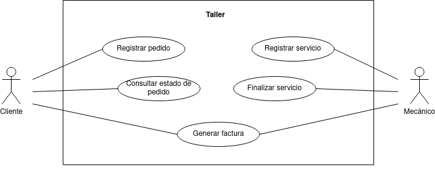

# Cajero automático

En este ejercicio procederemos a analizar el diagrama de comportamiento de la siguiente imagen: 

## Actores
| Actor | Cliente |
|---|---|
| Descripción | Persona que solicita servicios de reparación para un vehículo en el taller. |
| Características | Proporciona información sobre el vehículo y las reparaciones necesarias. |
| Relaciones | Interactúa con el Mecánico para registrar pedidos y consultar el estado de los mismos. |
| Referencias | Registrar Pedido, Consultar Estado Pedido, Generar Factura |
| Notas | Este actor puede ser un cliente individual o una empresa con una flota de vehículos. |
| Autor | Rashi Chugani Narwanni |
| Fecha | 11/02/2024 |

| Actor | Mecánico |
|---|---|
| Descripción | Profesional encargado de realizar las reparaciones y mantenimiento de los vehículos en el taller. |
| Características | Posee conocimientos técnicos sobre automóviles y herramientas para llevar a cabo las reparaciones. |
| Relaciones | Interactúa con el Cliente para registrar y finalizar servicios. |
| Referencias | Registrar Servicio, Finalizar Servicio |
| Notas | Puede haber varios mecánicos trabajando en el taller simultáneamente. |
| Autor | Rashi Chugani Narwanni |
| Fecha | 11/02/2024 |

## Casos de Uso
| Caso de Uso | Registrar Pedido |
|---|---|
| Fuentes     | Especificación del sistema de taller. |
| Actor       | Cliente               |
| Descripción | El cliente registra un pedido para reparar un vehículo en el taller. |
| Flujo básico | 1. El cliente proporciona información sobre el vehículo y las reparaciones necesarias.   2. El sistema registra el pedido. |
| Pre-condiciones | El cliente debe estar registrado en el sistema. |
| Post-condiciones | Se crea un nuevo pedido en el sistema. |
| Requerimientos | Ninguno               |
| Notas       | Pueden incluirse detalles adicionales sobre el estado del vehículo o las preferencias del cliente. |
| Autor | Rashi Chugani Narwanni |
| Fecha | 11/02/2024 |

| Caso de Uso | Consultar Estado Pedido |
|---|---|
| Fuentes     | Especificación del sistema de taller. |
| Actor       | Cliente                |
| Descripción | El cliente verifica el estado de un pedido realizado previamente en el taller. |
| Flujo básico | 1. El cliente ingresa al sistema de taller.   2. El cliente busca el pedido utilizando un identificador único o el número de placa del vehículo.   3. El sistema muestra el estado actual del pedido. |
| Pre-condiciones | El cliente debe haber registrado al menos un pedido previamente. |
| Post-condiciones | El cliente está informado sobre el estado del pedido. |
| Requerimientos | Ninguno                |
| Notas       | El estado del pedido puede incluir información sobre las reparaciones realizadas y el tiempo estimado de finalización. |
| Autor | Rashi Chugani Narwanni |
| Fecha | 11/02/2024 |

| Caso de Uso | Registrar Servicio |
|---|---|
| Fuentes     | Especificación del sistema de taller. |
| Actor       | Mecánico              |
| Descripción | El mecánico registra los servicios realizados en un vehículo. |
| Flujo básico | 1. El mecánico ingresa al sistema de taller.   2. El mecánico busca el pedido utilizando un identificador único o el número de placa del vehículo.   3. El mecánico registra los servicios realizados y cualquier pieza reemplazada. |
| Pre-condiciones | El mecánico debe haber sido asignado a un pedido existente. |
| Post-condiciones | Los servicios y las piezas reemplazadas se registran en el sistema. |
| Requerimientos | Ninguno               |
| Notas       | Este caso de uso puede implicar la actualización del estado del vehículo y la disponibilidad de piezas en el inventario. |
| Autor | Rashi Chugani Narwanni |
| Fecha | 11/02/2024 |

| Caso de Uso | Finalizar Servicio |
|---|---|
| Fuentes     | Especificación del sistema de taller. |
| Actor       | Mecánico              |
| Descripción | El mecánico marca un pedido como completado una vez que todas las reparaciones han sido realizadas. |
| Flujo básico | 1. El mecánico ingresa al sistema de taller.   2. El mecánico busca el pedido utilizando un identificador único o el número de placa del vehículo.   3. El mecánico marca el pedido como completado. |
| Pre-condiciones | Todas las reparaciones deben haber sido realizadas satisfactoriamente. |
| Post-condiciones | El pedido se marca como completado en el sistema. |
| Requerimientos | Ninguno               |
| Notas       | Esta acción puede generar automáticamente la generación de una factura para el cliente. |
| Autor | Rashi Chugani Narwanni |
| Fecha | 11/02/2024 |

| Caso de Uso | Generar Factura |
|---|---|
| Fuentes     | Especificación del sistema de taller. |
| Actor       | Mecánico, Cliente     |
| Descripción | El sistema genera una factura para el cliente una vez que el servicio ha sido completado. |
| Flujo básico | 1. El sistema identifica los servicios realizados y las piezas reemplazadas en un pedido.   2. El sistema calcula el monto total a pagar.   3. El sistema genera una factura detallada.   4. La factura se envía al cliente. |
| Pre-condiciones | El pedido debe haber sido marcado como completado por el mecánico. |
| Post-condiciones | El cliente recibe una factura detallada. |
| Requerimientos | Ninguno               |
| Notas       | La factura puede incluir detalles como el costo de la mano de obra, el costo de las piezas reemplazadas y los impuestos aplicables. |
| Autor       | Taller XYZ            |
| Fecha       | 2024-02-11            |
